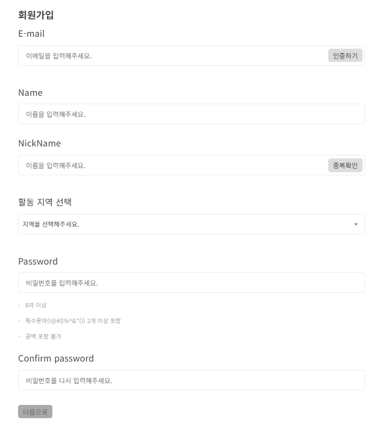
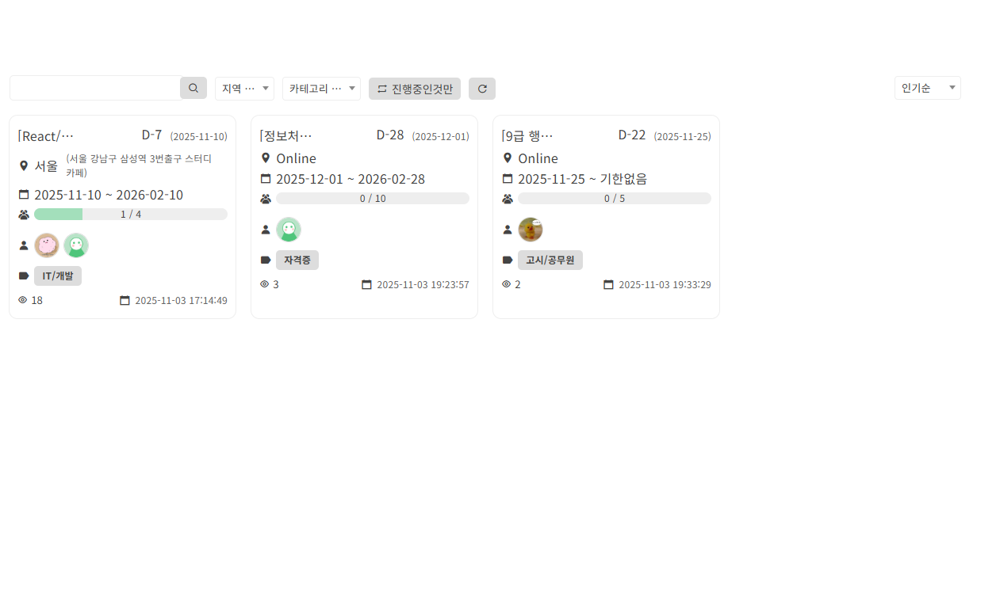
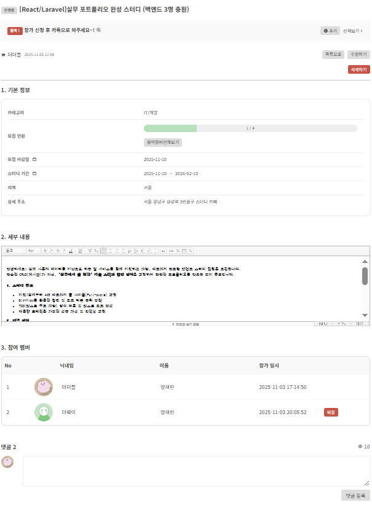
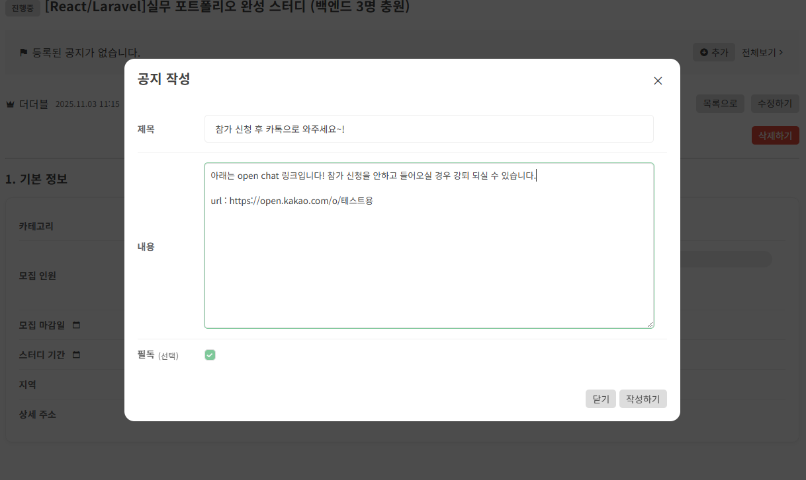
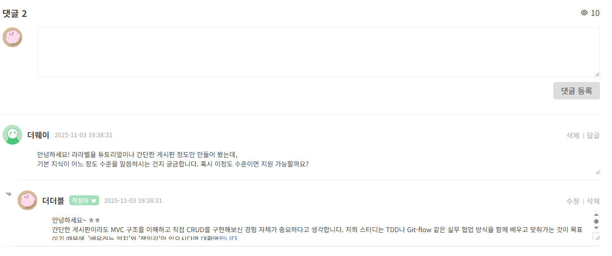
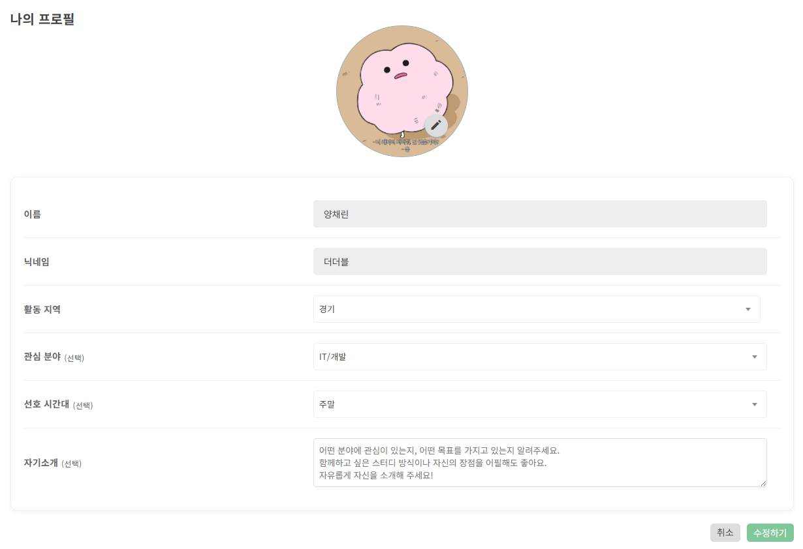

# StudyMate – 스터디 모집 플랫폼

스터디 모집 웹사이트로, 현재 fly.io로 배포하여 **Docker 기반 Nginx + Laravel + TiDB(MySQL 호환) 환경**에서 구동됩니다.  
메일 인증 회원가입, 스터디 CRUD, 검색/정렬/페이지네이션, 프로필 이미지 관리 등 **실제 서비스 수준 기능**을 구현하고, **배포 자동화**까지 목표로 한 프로젝트입니다.

https://studymate.fly.dev/
---

## 기술 스택

- **Backend:** PHP 8.2 (Laravel Framework 12.26.4) – Laravel 사용 + 모델기반 + 비동기 통신  
- **Frontend:** Blade Template, Scss, Javascript, JQuery – 인터랙티브 UI  
- **DB:** TiDB (MySQL 호환) – 안정적 클라우드 배포용  
- **Infra:** Docker, Nginx, Fly.io, Vite – 멀티 컨테이너 배포 및 CI/CD  
- **Mail Service:** Brevo (SMTP) – 회원 인증 및 알림  

---

## 개발 의도

평소 지인과 스터디를 진행하며 반복되는 모집·참여 과정을 효율화하고자 시작한 프로젝트입니다.  
단순 CRUD를 넘어 **검색/정렬/조회수** 등 사용자 편의 기능을 구현하고, **Docker + Fly.io 기반 CI/CD** 환경을 구성하여 실제 운영 흐름까지 경험했습니다.

---

## 주요 설계 포인트

1. **도커 기반 멀티 컨테이너 구조**  
   - PHP-FPM, Nginx, DB를 분리하여 **서비스 안정성 및 확장성 확보**

2. **TiDB 전환**  
   - 무료 MySQL 호환 DB 중 **클라우드 배포 안정성**이 높아 선택

3. **메일 인증 처리**  
   - Brevo SMTP API 연동 → **회원 가입 안정성 강화**

4. **보안/운영 고려**  
   - 비밀번호 해시화, Fly.io Secret 환경변수 사용 → **개인정보 보호 및 배포 안전성**

## 스크린샷

### 1. 회원가입 / 로그인
  
- 사용자가 처음 접하는 화면입니다. 이메일 인증 기능이 포함되어 있어 실제 메일에서 인증 링크를 확인할 수 있습니다.
- 회원가입 시 미리 닉네임 중복체크 기능도 구현되어 있습니다.
---

### 2. 스터디 목록 / 검색 / 정렬
  
모든 스터디를 조회할 수 있으며, 검색, 정렬, 페이지네이션 기능을 지원합니다.

---

### 3. 스터디 상세 페이지
#### 3-1. 기본 설명
  
선택한 스터디의 상세 정보 확인 및 참여/취소가 가능합니다.

#### 3-2. 공지

- 스터디의 전체 공지로 방장만이 작성 가능하며 필수 표시와 전체 리스트를 한번에 확인 가능 합니다.

#### 3-3. 댓글

- 스터디의 문의사항을 직접 소통할 수 있는 댓글 기능과 답글 기능을 지원합니다.
---

### 4. 프로필 관리
  
사용자 프로필 이미지 업로드 및 기타 정보를 수정할 수 있습니다.

